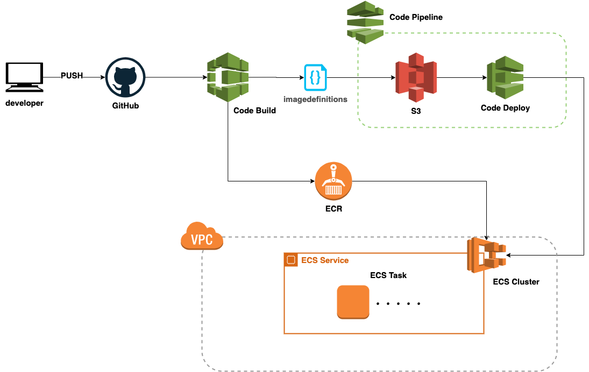
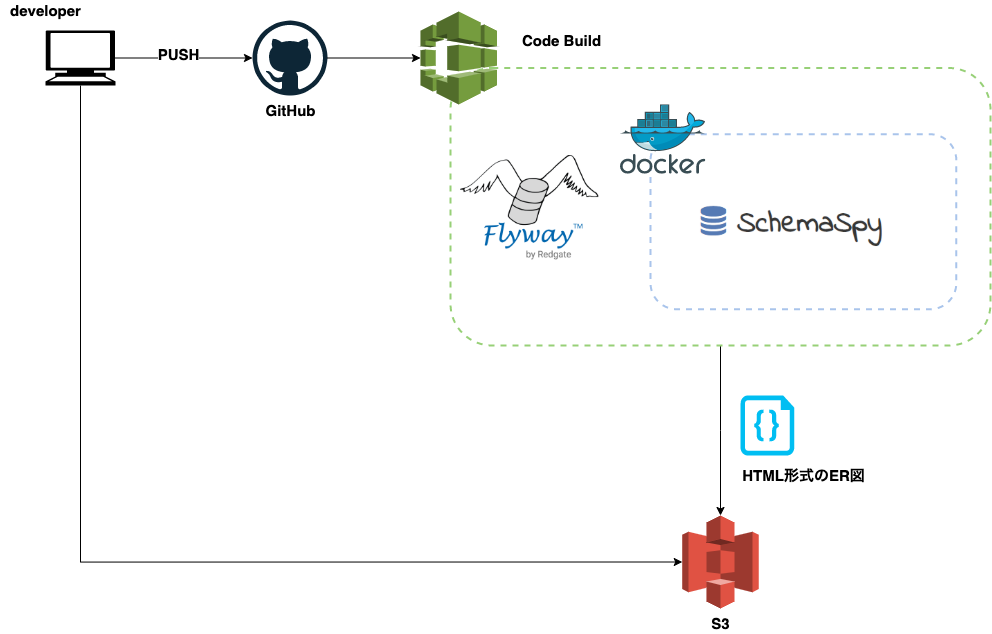
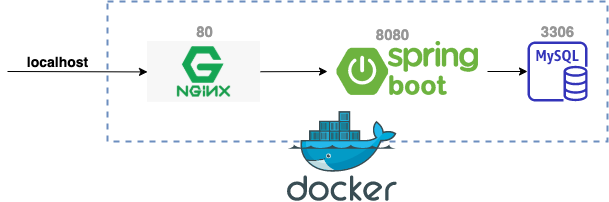

# kotlin-spring-template  

・最近ハマっている Kotlin+SpringBoot の組み合わせの、あらかじめ自分好みに設定したどの環境でもすぐに動作させられるテンプレートです。(Docker、AWS想定)  

## 使用技術、ツール、環境

| 項目 | バージョン | 用途 | 必須 | 備考 |
|:-----------:|:-----------:|:-----------:|:-----------:|:-----------:|
| JDK | 1.8 | 言語 | ○ |  |
| Kotlint | 1.3.72 | 言語 | ○ |  |
| Gradle | 6.3 | 依存関係 | ○ | kotlin-dsl |
| Spring Boot | 2.2.6 | フレームワーク | ○ | |
| MySQL | 8.0 | データベース | ○ |  |
| nginx | 1.17.2 | リバースプロキシ | △ |  |
| Docker | 指定なし | 仮想コンテナ | ○ |  |
| docker-compose | 指定なし | マルチコンテナ | ○ |  |
| InteliJ IDEA | 指定なし | IDE | × | 基本なんでも🙆‍♂️ |
| Git | 指定なし | ソース管理 | × | |  

※ Dockerを使用しない場合はJDK、MySQL、nginxのインストールが別途必要です。

## 依存ライブラリ  

| 項目 | バージョン | 用途 |  備考 |
|:-----------:|:-----------:|:-----------:|:-----------:|
| JPA | 2.3.0 | ORマッパー | |
| jpamodelgen | 5.4.15 | メタモデル | タイプセーフ |
| thymeleaf | 3 | テンプレートエンジン | |
| Flyway | 5.2.3 | マイグレーション |  |
| H2 | 1.4.191 | インメモリDB | CI/CD用 |

## CI/CD構成  

### ECSのデプロイ  

buildspecをそれぞれの環境に適した設定で修正し、AWSコンソールから設定が必要。  
参考 → [AWS公式ドキュメント](https://aws.amazon.com/jp/premiumsupport/knowledge-center/codepipeline-github-enterprise-ecs-app/ "AWS")  

### ER図のホスティング

buildspecをそれぞれの環境に適した設定で修正し、Code Build上でSchemaSpyを実行。(AWSコンソールで設定をする)  
生成されたHTMLをアーティファクトとしてS3に出力し、ホスティングする。

## 環境構築手順  

1.リポジトリのクローン  
`git clone git@github.com:s-moteki/kotlin-spring-template.git`  

2.ディレクトリの移動  
`cd kotlin-spring-template`

3.DBコンテナの起動  
`docker-compose up -d --build sample_db`

4.プロジェクトのビルド  
`./gradlew clean build`  

5.コンテナ全体を起動  
`docker-compose up --build`  

※次回以降手順2、5で起動

### 起動後イメージ

